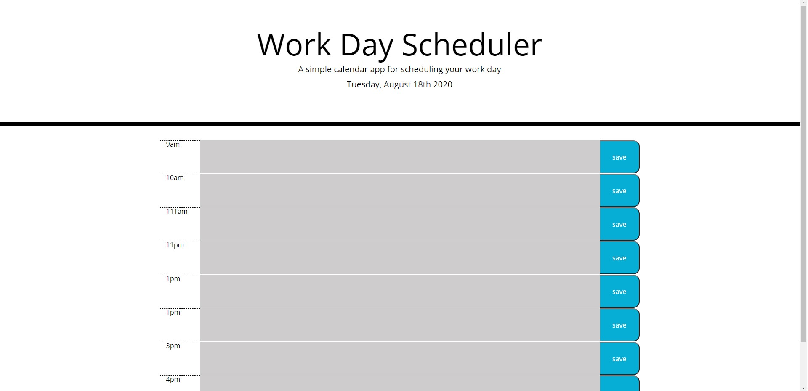

Day Planner App

Task: "Create a simple calendar application that allows the user to save events for each hour of the day. This app will run in the browser and feature dynamically updated HTML and CSS powered by jQuery."

This is a simple work dat scheduling app.

The project was to create an app that would allow for the user to see the current date in day of the week, month, date, year format.

They can then click into the text box for each time from 9am to 5pm to schedule an activity. 

To the right of the text box is a save button.

gitHub repo url https://github.com/SelessL/dayplanner
deployed site url https://selessl.github.io/dayplanner/

Screenshot of page

